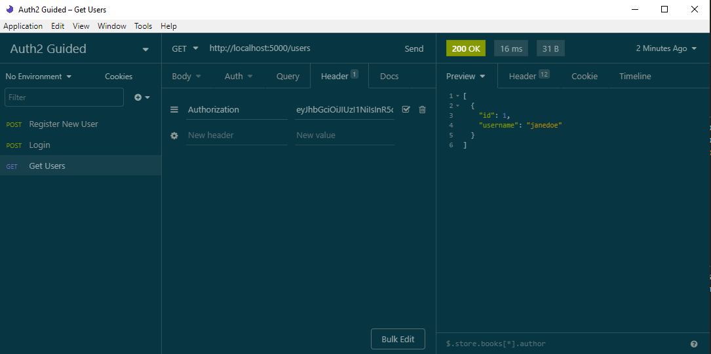

# Using JSON Web Tokens (JWT)

## Big Ideas
1. Difference between AuthN (authentication) and AuthZ (authorization)
    
    * Permission vs Authority 
        
        * AuthN - who are you? 
        
            * Like logging in
        
        * AuthZ - what do you want?
        
            * Gains access to specific things

2. **Salting** in the context of hashing is a random string that is attached to the front or the back of the password. 
    
    * When you hash it, you hash your password along with that random string. That way, your hashes are unique. 
    
    
    * It protects against rainbow tables.

3. How would you create a AuthN Flow? 

    * Create a Login endpoint, where it accepts a username and a password in req.body

    * Lookup the user from the database by the username. 

        * If they don't exist, return an error.

    * If the user exists, hash the password and compare it to what we have in the database.

        * If the comparison fails, then the password we received from the req.body is incorrect and the login fails. We could send a message stating "wrong password."

        * If the hashes do match, that means we have the correct username and the correct password. The user is authenticated at that point.

    * Create a new session and send it back as a cookie. Express-session does this automatically behind the scenes. It sets that session, saves it in the memory, and sends the data back as a cookie.

        * The client (Insomnia, the browser, etc) is going to store that cookie in its cookie jar and then it will automatically send that back up on all the subsequent requests. 

4. **Session** is like a virtual handstamp, wristband, or ticket stub that allows you to come back inside. It's just a piece of data that is store in memory or in a database that has information about the authentication so that the server remembers that you logged in. 

5. **Cookies** are a way for a client to persist a small chunk of data locally. It's kind of like local storage. It stores this data in something called a _cookie jar_. Then, on every subsequent request to an API, the client automatically sends all of the local data - all the cookies in the cookie jar - as a request header. It does all this automatically, behind the scenes.

    * When a new session is created, the server is going to send back the session ID inside of a cookie. That cookie is set locally on a client in local storage. Then that client is considered logged in. For now on, when that client makes a request to the API, it's sending that cookie back and that cookie contains the session ID so that it can validate that the user is actually logged in.

    * The `req.session.user = user` line in auth-router is just creating a new session using Express-Session. We just assign to that object.

6. How to Create an AuthZ Flow? 
    If we have an endpoint that we want to protect and only allow logged in users access to this endpoint, how do we create that authorization flow?

    * Take a look in users-router. We have an endpoint that is restricted to logged in users. We're just using some middleware. 
    
    * The restrict middleware just checks to see if there is a session. If there isn't, it sends a 401 error message. Otherwise, the user is granted access to the resource. 

    * We just use this restrict middleware on any endpoint that we want protected as an authorized endpoint.

7. What's one specific problem with this whole approach/flow of Authentication and Authorization? Think specifically about where the data is getting stored. We're just storing the sessions in memory. They're not being stored in a database. 

    * So what happens if our app gets super popular and our server just can't handle the traffic? You'd want to scale up your app to run on multiple servers at the same time. This is referred to as _horizontal scaling_.

        * You have to have a central place for sessions. 

        * Multiple servers don't share memory. They all have their own memory.

        * We have to make sure each session has access to that session store wherever it may be. Otherwise, a user could be potentially logged in on one of the servers and not be logged in on another for the same app.

        * Solution: Store your sessions in a database and make sure all your servers are connected to the same database.

    * But in our case, SQLite is a file-based DBMS so that DB file can't easily be shared. Therefore, we need a way to handle authorization in a stateless way. JSON Web Tokens could help with this.

8. **JSON Web Tokens** are sort of like a pre-authorized key card. 

    * They're also referred to as [JWTs](https://jwt.io/introduction/) or pronounced as _JOT_. It's a way for 2 parties to exchange JSON data securely without any shared state. 
    
    * It actually relies on cryptographic hashing, the same concept of when we hashed our passwords. It uses hashing to digitally sign the data and to make sure it was never ever tampered with.

    * Instead of having to verify a session in memory or database like we did before, if we're using JWTs then the server can know right away if the user's been authorized or not, just by looking at the token. It doesn't have to look up anything in memory, a database, or a file. It can just tell by looking at this token.

    * It is stateless. It does not have to save anything on the server.

    * The JWT itself is just a long string that consists of 3 chunks: `header.payload.signature`

        * A header is a base64-encoded (alphanumeric with special characters in it) object that contains 2 values:

            * Algorithm type - [HS256](https://auth0.com/blog/brute-forcing-hs256-is-possible-the-importance-of-using-strong-keys-to-sign-jwts/#JWT-Signing-Algorithms)

            * Type - in this case, it's just a JWT

            ```
            base64({
                algorithm: "HS256",
                type: "JWT"
            })
            ```
        
        * A payload - the data you want to pass back and forth between the server. It's also known as "claims." Claims is just a fancy word for user permissions. You can give it an ID and privileges associated with that ID.
            
            * This information is not private and is easily changed by anyone.Someone could take a JWT, decode it, and change their access level to unlimited when it wasn't supposed to be. 
        
            ```
            base64({
                membershipId: "12345",
                accessLevel: "unlimited",
            })
            ```
        
        * A signature - the most important piece of the token. The signature prevents unauthorized changes to the payload with cryptographic hashing. Just like when we could verify passwords when hashing, we can also verify any type of data, including objects. 
            
            * In our case, all the signature is is a hash of the header and the payload and a secret string that only the server knows about. 
            
            * The signature is really useful because it tells us if anything has ever changed in the header or the payload since the time we signed in (since the time that token was generated). We can tell if this data has been tampered with or changed at all.
            
            * If the signature doesn't match the payload, the payload does not get updated in the event we change our accessLevel from "basic" to "unlimited."
            
            ```
            hash(header + payload + secretString)
            ```

    * Scroll down to the Debugger on the [JWT homepage](https://jwt.io/). You will see that we have an example of an encoded and decoded example of a JWT. 

        * If you change things in the payload, you will see the encoded JWT changes as well.

        * Now go down to the Verify Signature section and create a secretString.

        * We can now use these tokens for authentication in a _stateless_ way. 

9. The New Authentication Flow using Tokens (in place of sessions)

    * The client sends the credentials to the server (the username and password from the Login endpoint)

    * Server is going to verify those credentials (look up the user, check the password hash)

    * Server generates a new JWT for the client

    * Server sends back the JWT as a header

    * The client stores the JWT in local storage

    * Client then sends that JWT back up on every subsequent request.

    * Server verifies the JWT is valid by checking the signature in the hash (no state is required)

    * If the signature is valid, the server provides access to the resource. Otherwise it sends back an error code 

10. Responsibilities of the Server and the Client in the AuthN Flow:
    
    * The responsibility of the _server_ in the AuthN Flow is to produce/generate the token, send it back to the client, read the token when it comes back, decode it and check the signature, and verify it.
    
    * It's the responsibility of the _client_ to store that token locally and send it back up on every request.

11. The biggest difference now between having to lookup a session in memory/database to verify that user is authorized, we just have to validate the JWT signature. It does not require any kind of network request - just a quick, cryptographic check. And if the user is valid, we know the user was properly authenticated. 

12. Drawbacks of Stateless Authentication - What's a potential problem of using JWTs instead of Sessions? 

    * **_It's nearly impossible to log the user out._**

        * We're not storing anything on the server side (nothing in the database or the memory). We're not storing any sessions anywhere. Once we issue that token - once we generate it and send it back - that user is logged in and we don't have any way to force them to log out.

        * A Couple Ways to Overcome this Drawback:
            
            * As a way to help with this drawback, we can give JWT expiration dates. 
            
            * Or you could use a method to create a "blacklist" of all the logged out tokens in your database and check against that list to see if anyone's logged out with that specific token. 

            * Or you can use JWTs _alongside_ sessions at the same time. Then use the JWT to store the session.

## Code Along!
Implement a JWT in our API

### AuthN Flow - Authentication Flow

The client sends the credentials to the server (the username and password from the Login endpoint). Server is going to verify those credentials (look up the user, check the password hash). Server generates a new JWT for the client. Server sends back the JWT as a header

1. Install JSON Web Token `npm install jsonwebtoken`

2. Import it into auth-router as `jwt`.

3. Go to the Login endpoint in auth-router.

4. When the user logs in, we're going to keep this same logic of getting the user by the database by the username and making sure they exist. We still want to validate the password/hash. 

5. At this point when we were creating a user session before (`req.session.user = user`), we no longer have to do that. Comment it out.

6. Create our payload after the password comparison code. Remember it is PUBLIC. So maybe you only want to use the user's ID here and maybe their role.

    * Since we don't actually have the userRole value in the database, we're going to fake it. We're going to fake it by adding a userRole and set it to normal or admin. This would normally come from the database.

7. Now we're going to actually generate a token with that payload. Create a new variable called `token`. If you look in the [documentation for the jsonwebtoken library](https://www.npmjs.com/package/jsonwebtoken#usage), you'll see that you can call `jwt.sign` with payload and a secret key. It's going to create that token for us.

    * It'll automatically create the header, automatically sign it, create that hash, automatically base64 everything... we just have to call that one function. 

8. Send it back to the client as part of the response body. `token: token,`

    * You could actually use the value from the token variable and replace the token value then get rid of the token variable above it.

9. Test to see if it works in Insomnia by making a request to register and then to login. 

    * Register `POST http://localhost:5000/auth/register`

    * Login `http://localhost:5000/auth/login`

10. After registering and logging in, we get a welcome message and a hashed token. 

    * Copy that token. 
    
    * Now, go back to the [JWT Encoded/Decoded page](https://jwt.io/) and insert the token (without quotes). 

        * It set the algorithm type to HS256 (the algo used to sign it) and set the type to JWT. 
        
        * It also set our userId and userRole in the payload. There's also an `iat` value, which stands for "issued at:". It's just at timestamp of when the token was created. 

        
    ```
    // GENERATE A NEW TOKEN

    const tokenPayload = {
        "userId": "user.id",
        "userRole": "normal", // this would normally come from the DB
    }

    //const token = jwt.sign(tokenPayload, "keep it secret, keep it safe") 

    res.json({
        message: `Welcome ${user.username}!`,
        //token: token,
        token: jwt.sign(tokenPayload, "keep it secret, keep it safe")
    })
    ```

    * **SIDE NOTE ON THE SECRET STRING**

        Let's talk about the secret string for a minute. Why do we have to use a secret string when we sign a token, when we sign a payload? Why is that secret string important?

        If we knew what the secret string was used to sign the token in the first place, and we changed something in the token, we would have been able to resign it. 

        Since the signature is a combination of the header, the payload, and the secret string, if we knew what that secret string was, we'd be able to change anything in the payload and then resign it again with the secret string and it would be considered valid. 

        That secret string is what keeps our token secure. It prevents people from changing our token and resigning it. It's what keeps that payload data safe and unchanged.

        If you remember from our deployment lecture, what do we never want to do with secret values/strings? We never want them in our source code and deploy our repo to GitHub. We never want to hardcode them. How do we take the secret string out of our source code? Environment variables. 

11. Take the secret string out of our source code with Environment variables.

    * Install dotenv as a devDependency `npm install -D dotenv || npm install --save-dev dotenv`

    * Create a .env file in the root of our project.

    * Inside the new file, let's put a value for JWT_SECRET and set the value to our secret string.

    * Options to Read all the values in the .env file

        * Go into our package.json file. 
            
            * In our server script, add in `-r dotenv/config`. This will instruct dotenv to read our .env file. <br>

                `"server": "nodemon -r dotenv/config index.js",`

            * This version keeps all our environment variables and all of the configuration completely separate from our codebase so we could easily change environments without having to worry about how the variables are actually set.

        * In index, you could require dotenv.config and it will do the same as what we did in the package.json file

            * `require("dotenv").config`

            * You only have to call it once, which is why we put it in the index file. No need to require it on other files. As long as it gets called once, it will read in all those values.

    * Now that we're bringing in our .env file in place of the hardcoded string on the auth-router, we can now say `process.env.JWT_SECRET` on the token.

    * Test on Insomnia by trying to call Login. You should get a token.

    ```
    // .env \\

    JWT_SECRET="keep it secret, keep it safe"


    // package.json \\

    "scripts": {
        // Make dotenv read the .env file
		"server": "nodemon -r dotenv/config index.js", 
		"start": "node index.js"
	},


    // auth-router \\

    // generate a new token
    const tokenPayload = {
        "userId": "user.id",
        "userRole": "normal", // this would normally come from the DB
    }

    res.json({
        message: `Welcome ${user.username}!`,
        token: jwt.sign(tokenPayload, process.env.JWT_SECRET)
    })
    ```

### AuthZ Flow - Authorization Flow

Client then sends that JWT back up on every subsequent request. Server verifies the JWT is valid by checking the signature in the hash (no state is required). If the signature is valid, the server provides access to the resource. Otherwise it sends back an error code 

1. Let's make the users endpoint be the restricted route. Only logged in users can call this endpoint. We're calling the restrict middleware.

2. Look at the restrict middleware. Currently, it's just checking the session. Let's update this to use tokens instead of sessions. Comment out the if statement. 

3. Import the JWT library. `const jwt = require("jsonwebtoken")`

4. Validate the token in this middleware

    * Get the token from header called authorization, where the actual token value is going to come from

    * Right off the bat, if we know the client didn't send a token, we need to return an error. There's no point in trying to validate the token if it doesn't exist. 

        * If the token is undefined and we don't have that header, return a status of 401 with our authError. You're not authorized if you did not send a token.

    * By this point we know we have a token. The client sent a JWT as a header. We need to verify it and check the signature to make sure it's never been tampered with. Make sure the token actually validates. 

        * If you look in the documentation, you'll see we have another function called [jwt.verify()](https://www.npmjs.com/package/jsonwebtoken#jwtverifytoken-secretorpublickey-options-callback). We can pass an existing token and a secret key. It will tell us if it's valid or not by checking that signature.

        * Call it after the if statement. Pass in the `token` as the first param and then the secret key. The _third param_ is a callback function with 2 params itself - an error if there is an error and a decoded version of our payload. You can name the param whatever you want here.

        * Looking in the documentation again, look at the example of the invalid token. If the token is undefined then you can assume that the token is not validated. Something has been changed or isn't right.

        * If the value is not undefined, we can return that authError with a 401 status. 

        * But if the error is undefined and we make it to this point, we can assume they are validated. Just move on to the next piece of middleware by calling next. We only call next if that token verifies.

5. Maybe in later middleware functions or the actual endpoints or the actual route handlers, we may want to access some of that data that's in the payload. How would we attach that to the request so that we could use it later? `req.token = decodedPayload`.

    * At that point, if you need to access anything from that payload in a later middleware function or route handler, you can just call it from req.token.

    * Maybe you do actually need to look up the user in the database, then you can get the ID from that object.

6. Test on Insomnia by trying to call Login and then Users to send that token as a header to see if it works. When you send your request to Users, you'll get an error message because you didn't send anything to users. 

    * You can fix this error message by sending your Login token as a header in the get request. In the Header tab, set the header as `Authorization` and where it says `New value`, you paste in your token.

    * Run the Get request again. You should now get a 200 status with your ID and Username.

    <p align="center">
         
    </p>
    

7. Let's try something interesting. 

    * Copy the token and go to the [JWT Encoder/Decoder](https://jwt.io/) again. Paste the token into the Encoder. 
    
    * Change the userRole to "admin."

    * Copy the new token and paste into the Insomnia header. 

    * You should get a 401 Unauthorized message because the server recognized that you changed that token. It recognized that it was altered and something wasn't right. It's not going to let you through all without looking anything up. It's all stateless.


    ```
    const jwt = require("jsonwebtoken")

    
    try {
        <!-- if (!req.session || !req.session.user) {
            return res.status(401).json(authError)
        } -->
                    //req.headers.whateverTheNameOfTheHeaderIs
        const token = req.headers.authorization
        if (!token) {
            return res.status(401).json(authError)
        }

        jwt.verify(
            token, 
            process.env.JWT_SECRET, 
            function(err, decodedPayload) => {
                if (err) {
                    return res.status(401).json(authError)
                } 

                req.token = decodedPayload
                next()
            })
      } catch(err) {
        next(err)
    }
    ```